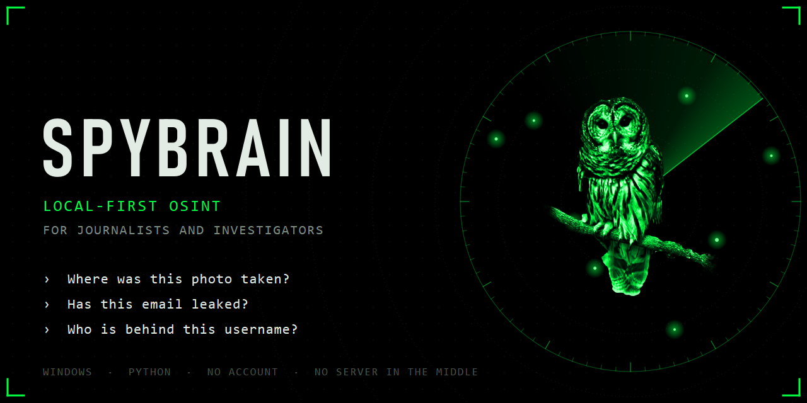
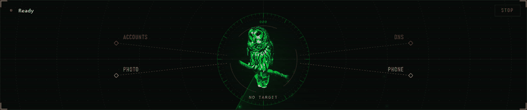
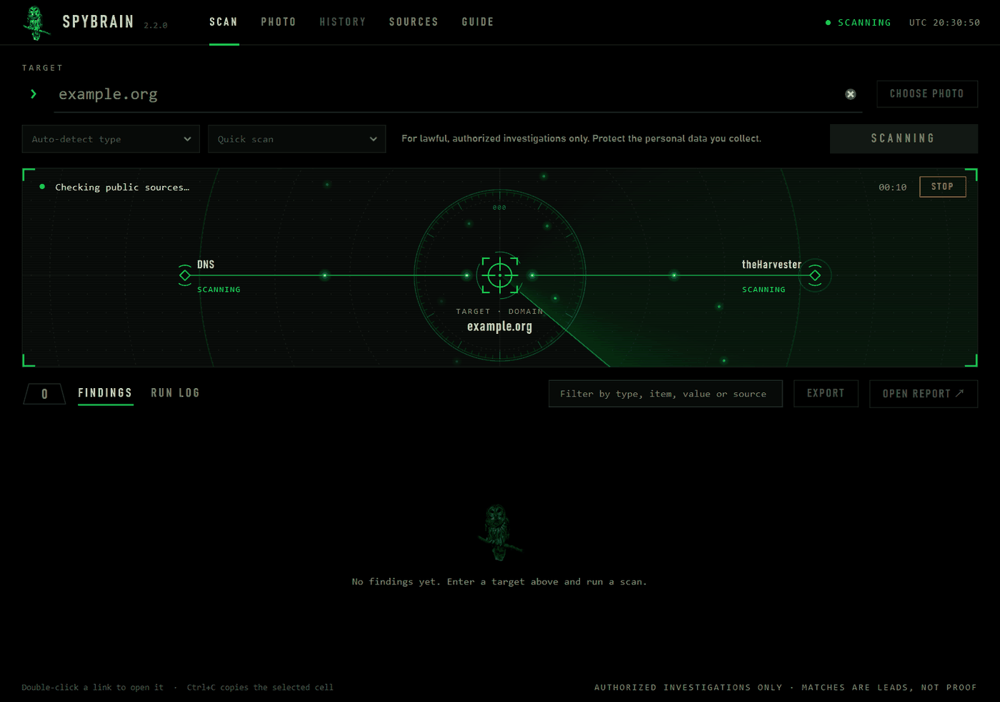
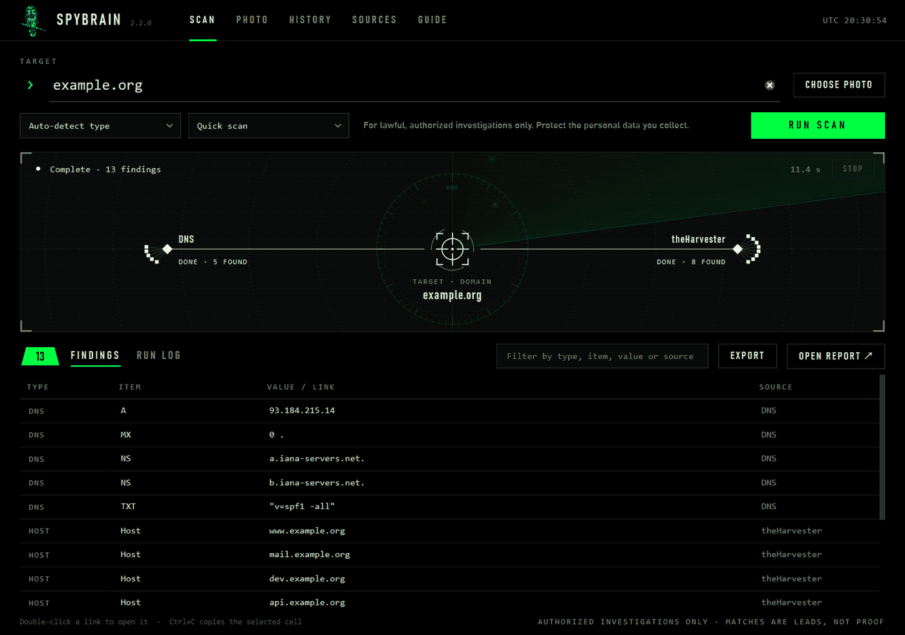
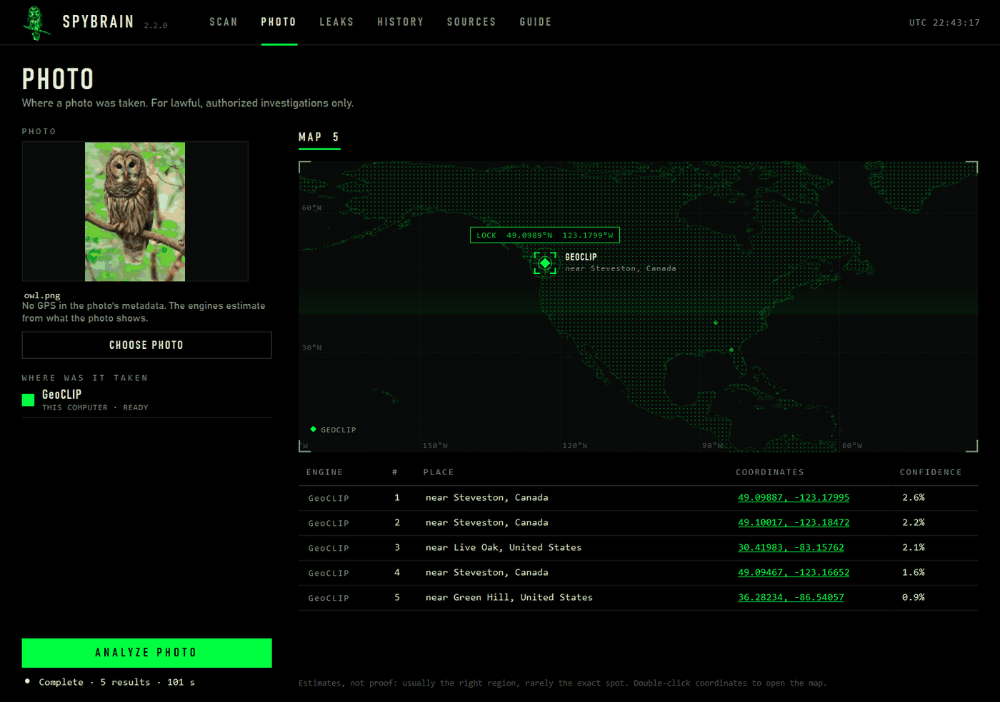
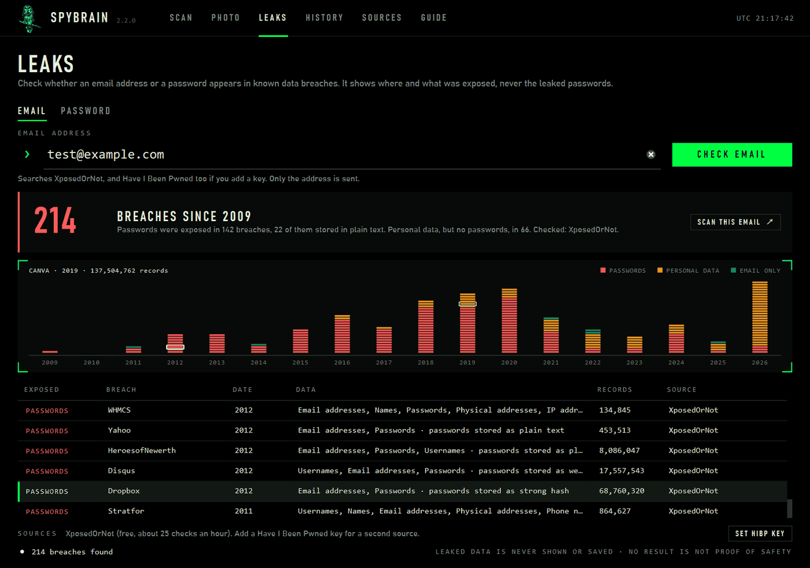
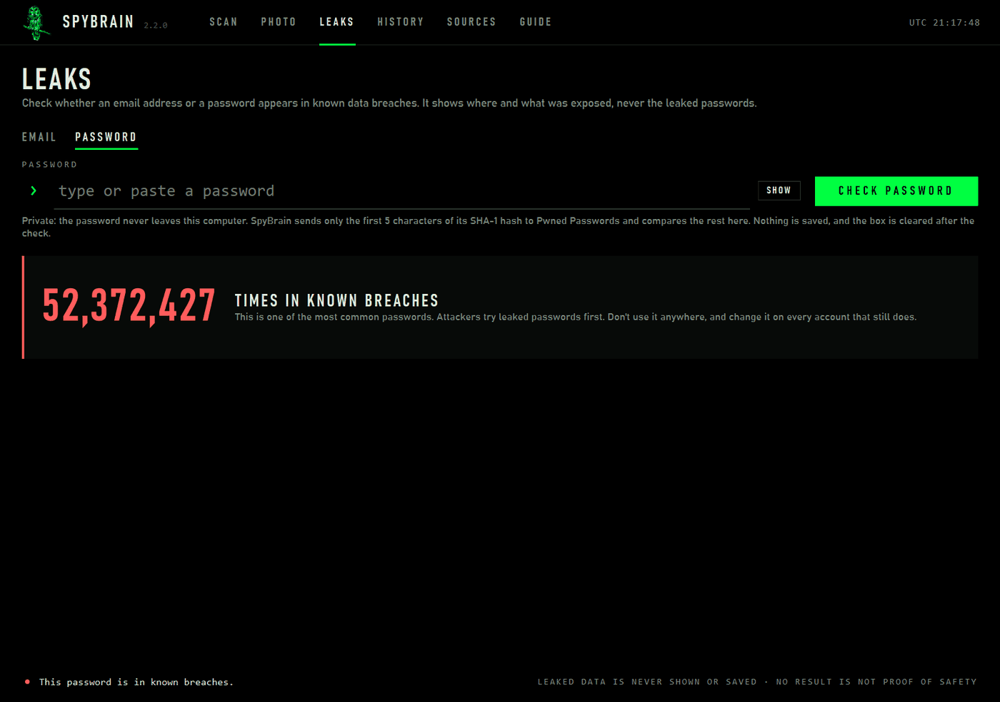
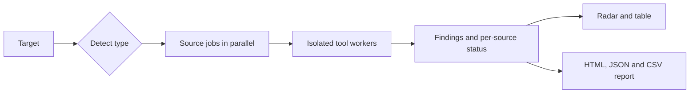

<p align="center">
  
</p>

<h1 align="center">SpyBrain</h1>

<p align="center">
  <b>The OSINT radar that lives on your desktop.</b><br>
  Point it at a username, a domain, an email, a phone number or a photo, and watch it light up.
</p>

<p align="center">
  
  
  
  
</p>

<p align="center">
  
</p>

## Three questions, one screen

- **Where was this photo taken?** A model that runs on your own computer compares it with 100,000 places and drops pins on a map.
- **Has this email or password leaked?** A breach timeline shows when, and what was exposed.
- **Who is behind this username, domain or phone number?** Public sources are queried in parallel and the findings pin themselves to the radar.

## Why SpyBrain

- **Local-first.** No account, no cloud, no server of ours in the middle. Reports, history and API keys stay on your PC (keys are encrypted with Windows DPAPI). Photo geolocation works offline after a one-time model download.
- **Made for people who verify things.** Findings are leads, not proof. Every source reports its own status, one failing source never stops a scan, and every scan is saved as HTML, JSON and CSV.
- **Guardrails built in.** Leaked passwords and breach records are never shown or saved. The password check sends only 5 characters of a hash. The optional face search is switched off in this build; when enabled it needs a stated purpose and refuses photos of children.
- **A tool you want to open.** Black and terminal green, an animated radar, a dot-matrix world map. It respects the Windows setting for reduced animations.

## What's inside

### Scan: one target, many sources



| Target | Sources |
|---|---|
| Username | Sherlock + Maigret, merged accounts and public identifiers |
| Domain | DNS records + theHarvester (hosts, IP addresses, emails) |
| Phone number | libphonenumber + PhoneInfoga (optional) |
| Email | Breach check, plus the name before @ as a username and the domain |
| Photo file | EXIF, GPS, dimensions and SHA-256, read locally |

Results arrive as each source finishes. Filter and sort the table, read each source's log, stop at any time and keep what finished.



### Photo: where was this taken?



[GeoCLIP](https://github.com/VicenteVivan/geo-clip) (MIT) estimates the location from what the photo shows. Probes ping the map while it works, pins drop in, and a crosshair locks onto the best estimate. If the photo already stores GPS, it is marked so you can compare. Estimates are usually right about the region and rarely about the exact spot.

### Leaks: has it been breached?



Every square is a breach: red where passwords were exposed, amber where personal data was, green where only the address was. Click one to find it in the list. Sources are [XposedOrNot](https://xposedornot.com) (no key) and, if you add your own key, [Have I Been Pwned](https://haveibeenpwned.com).



The password check uses the [Pwned Passwords](https://haveibeenpwned.com/Passwords) range API: only the first 5 characters of the SHA-1 hash leave your computer, and the match is made locally. The box is cleared right after the check.

## Quick start

Windows 10 or 11, Python 3.13 and Git.

```powershell
git clone https://github.com/skriptkiddy98x/spybrain.git
cd spybrain
py -3.13 -m venv .venv
.\.venv\Scripts\python.exe -m pip install -r requirements-lock.txt
.\.venv\Scripts\python.exe app.py
```

The first photo analysis downloads a 1.7 GB model once and prepares the places, which can take a few minutes. After that a photo takes about half a minute.

- **Tests:** `.\.venv\Scripts\python.exe -m unittest discover -s tests -v` (159 tests).
- **Command line:** `.\.venv\Scripts\python.exe osinthub.py example.org --fast`.
- **PhoneInfoga:** optional, see [`bin/README.md`](bin/README.md).
- **Build an EXE:** `powershell -ExecutionPolicy Bypass -File .\build.ps1` runs the tests and then PyInstaller (about 15 minutes, because of PyTorch). The result is not code-signed, so Windows SmartScreen may warn on first start.

The full reference is in the [user guide](docs/USER-GUIDE.md).

## How it works



| File | Role |
|---|---|
| `app.py` | PySide6 interface: custom-painted radar, map and breach timeline |
| `osinthub.py` | Scan engine: validation, parallel jobs, isolated workers, reports, CLI |
| `geolocate.py` | Photo engines (GeoCLIP, plus optional online engines that are switched off) and key storage |
| `leaks.py` | Breach and password checks |

## Responsible use

SpyBrain is for **lawful, authorized investigations** by journalists, investigators and threat-intelligence teams. Don't use it to stalk, harass or expose private people. Findings can be wrong and a matching name is not proof of identity: verify every lead by hand, and protect saved reports as the personal data they are. SpyBrain does not try to identify anyone from their face. You are responsible for following the law where you work, including data protection rules.

## Roadmap

Ideas, not promises:

- HEIC photos, text-in-photo recognition, a second geolocation model for street-level photos
- Photo authenticity checks (edit traces, Content Credentials)
- Case files with evidence hashes and PDF export
- Video analysis

## Credits

Built on [Sherlock](https://github.com/sherlock-project/sherlock), [Maigret](https://github.com/soxoj/maigret), [theHarvester](https://github.com/laramies/theHarvester), [PhoneInfoga](https://github.com/sundowndev/phoneinfoga), [GeoCLIP](https://github.com/VicenteVivan/geo-clip) and OpenAI CLIP, [GeoNames](https://www.geonames.org/) (CC BY 4.0), [Natural Earth](https://www.naturalearthdata.com/), [XposedOrNot](https://xposedornot.com) and [Have I Been Pwned](https://haveibeenpwned.com) (breach data CC BY 4.0). Full list and licenses: [THIRD_PARTY_NOTICES.md](THIRD_PARTY_NOTICES.md).

## License

All rights reserved. The source is public so you can read, review and learn from it; using, copying, modifying or redistributing it requires the author's written permission. A license may be added later.
